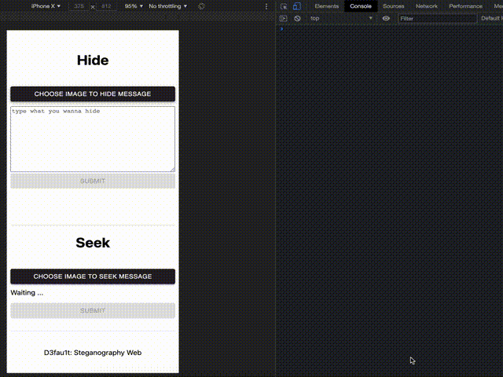

# Image Steganography


What you see isn't everything.

This image contains hidden data.



## Dependency

numpy, pillow, click, ...

Check [pyproject.toml](pyproject.toml)

## Install

```bash
pip install -r web/requirements.txt
```

## Use as a module

### Hide message

converts the input string to binary and replaces the LSB of each pixel

```bash
# case 1. use default setting
python examples/hide.py

# case 2. input options
python examples/hide.py -in image.png -out output.png -m message.txt

# case 3. binjector from pypi
binjector hide -i image.png -o output.png -m message.txt
```

### Seek message

Concatenate each LSB in the image to see the hidden string.

```bash

# case 1. use default setting
python examples/seek.py

# case 2. input options
python examples/seek.py -in output.png

# case 3. binjector from pypi
binjector seek -i output.png
```

## Serve as WebServer (with FastAPI)

can serve steganography module on web server if you want.

```bash
uvicorn web.server.main:app --host=0.0.0.0 --port=8000
```

### Connect to browser (with Next.js)

can serve steganography webpage if you want

```bash
cd web/client && yarn && yarn dev
```

### API Document

[Automatic docs](https://fastapi.tiangolo.com/features/#automatic-docs)

Check this out

- [docs](https://image-steganography-d3fau1t.herokuapp.com/docs)
- [redoc](https://image-steganography-d3fau1t.herokuapp.com/redoc)

## Appendix

### Check setting file

You can check the image path or other required values.

```json
{
  "encoding": "utf8",
  "bits": 8,
  "token_string": "#secret#",
  "message": "./message.txt",
  "in_image": "./image.png",
  "out_image": "./output.png",
  "modified_image": "./output.png"
}
```
